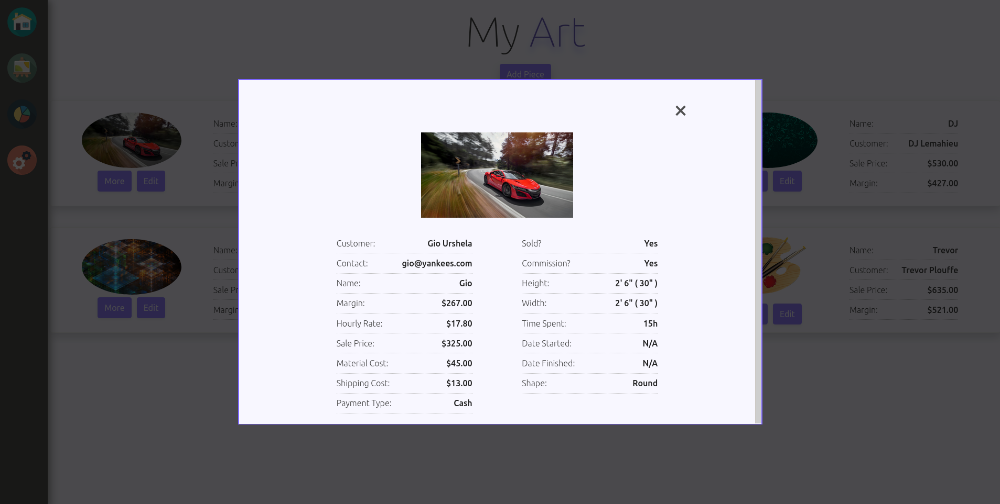

# Artist's Accountant

> A full stack web app built in C# with ASP.Net Core, MS SQL Server, React Typescript and Google Firebase for cloud
> image storage.

  
 

<!-- Check out the app [HERE]()! -->




I worked with the following concepts while building this application:

> Microsoft Sql Server and interacting with database through query strings

> Google Firebase cloud storage for user uploaded images

> Continuing my TypeScript journey with a multi page application using interfaces and enums for strict typing

> Extension methods on SqlDataReader class to return nullabale types

> Write unit and integration tests using NUnit testing library and Moq mocking library.

> bCrypt encryption library for user passwords

> Json Web Tokens with ASP.Net built in authentication middleware

<!-- > Deployment Somewhere -->

> Focus on vanilla CSS for responsive sidebar navigation

## Installation

You will need to create a Firebase app to store user images you can get started with Firebase
[here](https://firebase.google.com/)

After setting up a Firebase account and a project you will recieve credentials for that project. Add a `.env` file in
`API/client/` with the following contents:

```
REACT_APP_FIREBASE_API_KEY="<firebase api key>"
REACT_APP_FIREBASE_AUTH_DOMAIN="<firebase auth domain>"
REACT_APP_FIREBASE_PROJECT_ID="<firebase project id>"
REACT_APP_FIREBASE_STORAGE_BUCKET="<firebase storage bucket>"
REACT_APP_FIREBASE_MESSAGING_SENDER_ID="<firebase messaging sender id>"
REACT_APP_FIREBASE_APP_ID="<firebase app id>"
```

You will also need to set up a MS Sql Server database locally with two tables. I have generated two scripts to create
the appropriate tables. They are located in `SqlServerScripts/`

After that you can add a file called `appsettings.Development.json` in the `API/` directory. The contents of the file
should be the following:

```
{
  "Logging": {
    "LogLevel": {
      "Default": "Information",
      "Microsoft": "Warning",
      "Microsoft.Hosting.Lifetime": "Information"
    }
  },
  "JwtKey": "<can be any string of 16 or more characters>",
  "SqlServer": {
    "Datasource": "<datasource (usually localhost)>",
    "Database": "<database name>",
    "Username": "<username>",
    "Password": "<password>"
  }
}
```

If you do not have npm on your system you will need to install it.

You can then go to the `API/client/` directory and run

`$ npm i` to install the client's dependency's.

To run the application:

    Run IIS in the API project in Visual Studio or Jetbrains Rider

    or

    Navigate to the `API/` folder and run:

`$ dotnet watch run`

## Author

### Brian Bastanza- Full Stack Web Developer

<a href="https://www.brianbastanza.me/" target="_blank" rel="noopener">Personal Website</a>

[LinkedIn](https://www.linkedin.com/in/bbastanza)
